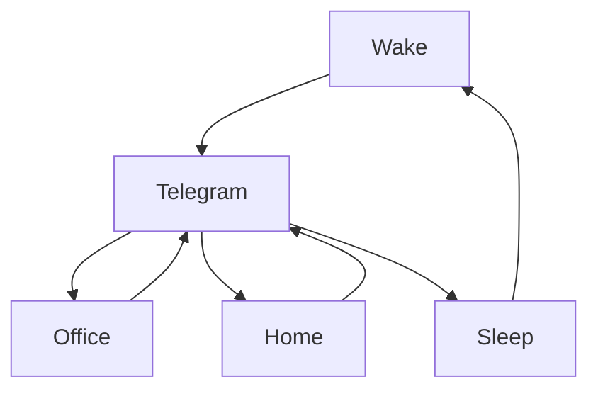

[](https://git.io/typing-svg)

<div align="center">
<a href="https://moon-svg.minung.dev">
    
  </a>
</div>

# Ravana Github Readme 

[](https://git.io/typing-svg)

[](https://github.com/ravana69)

<a href="https://www.data-card-for-spotify.com/card?user_id=31rfzgmuvvewegdlxvlev4ynz4vu">
  
</a>

[](https://git.io/typing-svg)


### 🎬 1tamilmv RSS Feed

<!-- BLOG-POST-LIST:START -->
- [Manmadhan &lpar;2004&rpar; Tamil 1080p Aha WEB-DL AAC2.0 H264-WA - 2.7GB](https://www.1tamilmv.help/index.php?/forums/topic/172684-manmadhan-2004-tamil-1080p-aha-web-dl-aac20-h264-wa-27gb/&do=findComment&comment=345005)
- [Mersal &lpar;2017&rpar; BluRay Original Audios - [Tamil - Telugu - Hindi - Malayalam - [#2160p #4K - 10GB - 5.5GB] [#1080p - 38GB - 6.7GB - 6GB - 4.5GB - 3.7GB - 3GB - 2GB - 1.9GB - 1.8GB][#720p - 1.8GB - 1.4GB - 900MB - 800MB] - ESubs](https://www.1tamilmv.help/index.php?/forums/topic/167266-mersal-2017-bluray-original-audios-tamil-telugu-hindi-malayalam-2160p-4k-10gb-55gb-1080p-38gb-67gb-6gb-45gb-37gb-3gb-2gb-19gb-18gb720p-18gb-14gb-900mb-800mb-esubs/&do=findComment&comment=345004)
- [Tamil Bluray - Music Videos Collection  BDRemux - AVC - DTS-HD MA 5.1 - DTS 5.1 - DD 5.1 - ESubs] &lpar;Direct Download&rpar;](https://www.1tamilmv.help/index.php?/forums/topic/172364-tamil-bluray-music-videos-collection-bdremux-avc-dts-hd-ma-51-dts-51-dd-51-esubs-direct-download/&do=findComment&comment=345003)
- [Thuppakki &lpar;2012&rpar; Tamil TRUE HD - AVC / DD5.1  - x264/x265 - HEVC - [#1080P - 3.8GB - 3.6GB - 12GB - 11.3GB - 9.5GB - 7.4GB - 6GB - 5GB - 4.5GB - 4.4GB - 3.5GB - 1.7GB - 1.2GB] - [#720p - 2.8GB - 1.5GB - 900MB] -[x264 - 700MB - 400MB] - ESub - Google Drive](https://www.1tamilmv.help/index.php?/forums/topic/167737-thuppakki-2012-tamil-true-hd-avc-dd51-x264x265-hevc-1080p-38gb-36gb-12gb-113gb-95gb-74gb-6gb-5gb-45gb-44gb-35gb-17gb-12gb-720p-28gb-15gb-900mb-x264-700mb-400mb-esub-google-drive/&do=findComment&comment=345002)
- [The Red Ghost &lpar;2020&rpar; &lpar;BluRay + Original Audios&rpar; - [1080p &amp; 720p - x264 - &lpar;Tamil + Telugu + Hindi + Eng&rpar; - 2.2GB &amp; 1.1GB | x264 - &lpar;Tam + Tel + Hin&rpar; - 450MB] - ESub](https://www.1tamilmv.help/index.php?/forums/topic/172680-the-red-ghost-2020-bluray-original-audios-1080p-720p-x264-tamil-telugu-hindi-eng-22gb-11gb-x264-tam-tel-hin-450mb-esub/&do=findComment&comment=345001)
<!-- BLOG-POST-LIST:END -->

## 🎧 Malayalam Songs Feed
<!-- BLOGPOSTS:START -->
- [Onninum Samayamillathodunna.. #eastersongs #jojijohns #madhubalakrishnansongs #christianvideosong](https://www.youtube.com/watch?v=K1BbfTC_87Q)
- [Ayyada Maname | Video Song | Vellaripattanam | Madhu Vasudevan |Sachin Shankor Mannath | Pushpavathi](https://www.youtube.com/watch?v=NGzgWaJQOto)
- [ദൈവമേ ഭഗവതിയാ... ഭഗവതിയെ കണ്ട് അന്തംവിട്ട് പ്രേക്ഷകര്‍ | Kallanum Bhagavathiyum | Theatre Response](https://www.youtube.com/watch?v=KFbItKpbzfc)
- [അവധിക്കാലം അടിച്ചു പൊളിക്കാൻ ഏറ്റവും നല്ല സിനിമ ഗാനങ്ങൾ  |Remastered Video Songs](https://www.youtube.com/watch?v=VCGCKLAXSfk)
- [Neerattu en manasarani | Anupallavi | Bichu thirumala | KJ Joy | Jayachandran | Vani jayaram | Jayan](https://www.youtube.com/watch?v=oDp8aRHpvXo)
- [പുതിയ തലമുറക്കും പഴയ തലമുറക്കും ഭാവി തലമുറക്കും വേണ്ടി ഒരുക്കിയ എക്കാലത്തെയും മികച്ച ഗാനങ്ങൾ !](https://www.youtube.com/watch?v=F6mLZZLwMXE)
<!-- BLOGPOSTS:END -->

[](https://git.io/typing-svg)

# Team:
<p align="center"> 
<p align="center"> 
<p align="center">   

# Nationality:
<div align="center">
<a href="https://ravana69.github.io/thisflagdoesnotexist/">
    
  </a>
</div>

# My Rented Home
<div align="center">
<a href="https://ravana69.github.io/thisrentaldoesnotexist/">
    
  </a>
</div>

# Work:

[](https://wakatime.com/@742e15ca-1e4c-47e9-85d8-14b80b31f9ec)

<!--START_SECTION:waka-->

```text
From: 27 March 2023 - To: 03 April 2023

Total Time: 17 hrs 35 mins

Other   17 hrs 35 mins  ▰▰▰▰▰▰▰▰▰▰▰▰▰▰▰▰▰▰▰▰▰▰▰▰▰   100.00 %
```

<!--END_SECTION:waka-->

[](https://git.io/typing-svg)


[](https://git.io/typing-svg)

<H1>My Routine</H1>




[](https://git.io/typing-svg)


[](https://git.io/typing-svg)


<br />

[](https://git.io/typing-svg)

<p align="left">
    <a href="#">
        
    </a>
    <a href="#">
        
    </a>
    <a href="#">
        
    </a>
</p>

[](https://git.io/typing-svg)


<p align="center">           
    


[](https://git.io/typing-svg)
  


[](https://git.io/typing-svg)
  
# Humans
<p align="center">

[](https://git.io/typing-svg)
  
# Bike N Angel
<p align="center">

# Moon Animation
<p align="center">

[](https://git.io/typing-svg)
  
# Hypnotic Loop

https://user-images.githubusercontent.com/47528708/176845771-6ad8f1d2-8008-4f49-ac35-5ebb89644732.mp4

[](https://git.io/typing-svg)

# Archive.org [⚓](https://archive.org/upload/?identifier=ravana-_)
## Profile
<p align="center">
    <a href="https://archive.org/details/@ravana69">
        
    </a>
    <br>
    
## Last 1000
<p align="center">
    <a href="https://catalogd.archive.org/catalog.php?history=1">
        
    </a>
    <br>

[](https://git.io/typing-svg)


[](https://git.io/typing-svg)


[](https://git.io/typing-svg)

[](https://hits.seeyoufarm.com)

# Timeline

[](https://google.com)
[](https://dday-widget.minung.dev)

 </img>
 </img>

 </img>
 </img>
 </img>
 </img>
 </img>


# [🌈🌈🌈🌈🌈🌈🌈🌈🌈🌈🌈🌈🌈🌈🌈🌈🌈🌈🌈🌈🌈🌈🌈](https://ibb.co/album/qYnLQX)

https://user-images.githubusercontent.com/47528708/227121919-08688d26-dca6-421d-81cf-fa4b7a167683.mp4

<p align="center">           
