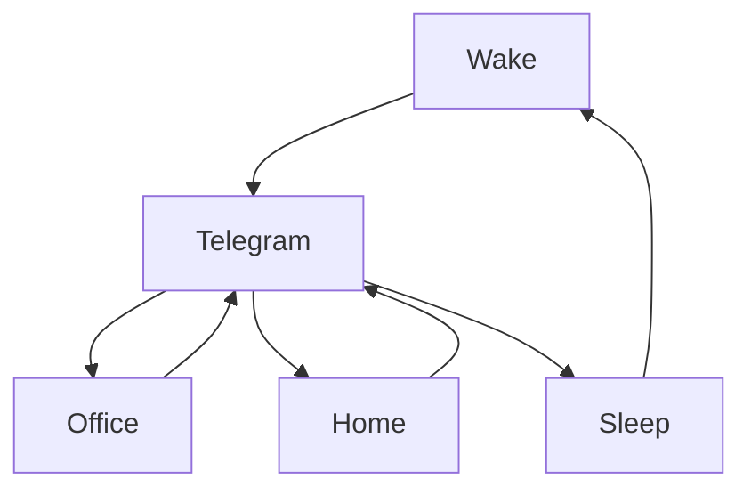

[](https://git.io/typing-svg)

<div align="center">
<a href="https://moon-svg.minung.dev">
    
  </a>
</div>

# Ravana Github Readme 

[](https://git.io/typing-svg)

[](https://github.com/ravana69)

<a href="https://www.data-card-for-spotify.com/card?user_id=31rfzgmuvvewegdlxvlev4ynz4vu">
  
</a>

[](https://git.io/typing-svg)

### 🎬 1tamilmv RSS Feed

<!-- BLOG-POST-LIST:START -->
- [Bakasuran &lpar;2023&rpar; Tamil Proper HQ PreDVD - [1080p &amp; 720p - x264 - 2.6GB - 1.4GB &amp; 900MB | x264 - 700MB - 400MB &amp; 250MB] - HQ Clean Audio](https://www.1tamilmv.wtf/index.php?/forums/topic/171782-bakasuran-2023-tamil-proper-hq-predvd-1080p-720p-x264-26gb-14gb-900mb-x264-700mb-400mb-250mb-hq-clean-audio/&do=findComment&comment=342881)
- [Vaathi &lpar;2023&rpar; Tamil Proper HQ PreDVD - [1080p &amp; 720p - x264 - 2.6GB - 1.4GB &amp; 900MB | x264 - 700MB - 400MB &amp; 250MB] - HQ Clean Audio](https://www.1tamilmv.wtf/index.php?/forums/topic/171780-vaathi-2023-tamil-proper-hq-predvd-1080p-720p-x264-26gb-14gb-900mb-x264-700mb-400mb-250mb-hq-clean-audio/&do=findComment&comment=342880)
- [Thunivu &lpar;202&rpar; Hindi Pre DVD - [1080p &amp; 720p - x264 - 2.5GB &amp; 1.3GB| x264 - 700MB &amp; 400MB] - HQ Dub](https://www.1tamilmv.wtf/index.php?/forums/topic/170995-thunivu-202-hindi-pre-dvd-1080p-720p-x264-25gb-13gb-x264-700mb-400mb-hq-dub/&do=findComment&comment=342879)
- [Request your movies as a comment to this topic.!](https://www.1tamilmv.wtf/index.php?/forums/topic/79-request-your-movies-as-a-comment-to-this-topic/&do=findComment&comment=342878)
- [Scene ah Scene ah &lpar;From &quot;Maaveeran&quot;&rpar; &lpar;2023&rpar; Tamil [ALAC &amp; FLAC] [24Bit/16Bit] iTunes HQ MP3 [320Kbps &amp; 128Kbps] - Bharath S Musical](https://www.1tamilmv.wtf/index.php?/forums/topic/171788-scene-ah-scene-ah-from-maaveeran-2023-tamil-alac-flac-24bit16bit-itunes-hq-mp3-320kbps-128kbps-bharath-s-musical/&do=findComment&comment=342877)
<!-- BLOG-POST-LIST:END -->

## 🎧 Malayalam Songs Feed
<!-- BLOGPOSTS:START -->
- [Ee Kalpadavil | Out Of Syllabus | Rafeeq Ahamed | Bennet-Veetrag | Parvathy Thiruvoth | G Venugopal](https://www.youtube.com/watch?v=SBCsmuk8kxY)
- [17 February 2023](https://www.youtube.com/watch?v=mnQbC4v7bko)
- [Christian Melody Songs | Joby Kidaram | Divine Night Songs | Christian Devotional Songs Malayalam](https://www.youtube.com/watch?v=UyyPp72UGMU)
- [Romancham - Title Track | Sushin Shyam| Johnpaul George Productions| Jithu Madhavan](https://www.youtube.com/watch?v=GFA9C2h1lJU)
- [Parakkatte Velichamengum | Uriyadi | Anil Panachooran | Ishaan Dev | Jasy Gift | VaikomVijayalakshmi](https://www.youtube.com/watch?v=zg-tfAvdqnY)
- [തരളിതരാവില്‍ മയങ്ങിയോ | Soorya Manasam | Evergreen Film Song | Mammootty | KJ Yesudas](https://www.youtube.com/watch?v=CeSkgoTT4DI)
<!-- BLOGPOSTS:END -->

[](https://git.io/typing-svg)

# Me:
<div align="center">
<a href="https://ravana69.github.io/thispersondoesnotexist/">
    
  </a>
</div>

# Nationality:
<div align="center">
<a href="https://ravana69.github.io/thisflagdoesnotexist/">
    
  </a>
</div>

# My Rented Home
<div align="center">
<a href="https://ravana69.github.io/thisrentaldoesnotexist/">
    
  </a>
</div>

# Work:

[](https://wakatime.com/@742e15ca-1e4c-47e9-85d8-14b80b31f9ec)

<!--START_SECTION:waka-->

```text
From: 10 February 2023 - To: 17 February 2023

Total Time: 11 hrs 2 mins

Other   11 hrs 2 mins   ▰▰▰▰▰▰▰▰▰▰▰▰▰▰▰▰▰▰▰▰▰▰▰▰▰   100.00 %
```

<!--END_SECTION:waka-->

[](https://git.io/typing-svg)


[](https://git.io/typing-svg)

<H1>My Routine</H1>




[](https://git.io/typing-svg)


[](https://git.io/typing-svg)


<br />

[](https://git.io/typing-svg)

<p align="left">
    <a href="#">
        
    </a>
    <a href="#">
        
    </a>
    <a href="#">
        
    </a>
</p>

[](https://git.io/typing-svg)


<p align="center">           
    


[](https://git.io/typing-svg)
  


[](https://git.io/typing-svg)
  
# Humans
<p align="center">

[](https://git.io/typing-svg)
  
# Bike N Angel
<p align="center">

[](https://git.io/typing-svg)
  
# Hypnotic Loop

https://user-images.githubusercontent.com/47528708/176845771-6ad8f1d2-8008-4f49-ac35-5ebb89644732.mp4

[](https://git.io/typing-svg)

# Archive.org [⚓](https://archive.org/upload/?identifier=ravana-_)
## Profile
<p align="center">
    <a href="https://archive.org/details/@ravana69">
        
    </a>
    <br>
    
## Last 1000
<p align="center">
    <a href="https://catalogd.archive.org/catalog.php?history=1">
        
    </a>
    <br>

[](https://git.io/typing-svg)


[](https://git.io/typing-svg)


[](https://git.io/typing-svg)

[](https://hits.seeyoufarm.com)

# Timeline

[](https://google.com)
[](https://dday-widget.minung.dev)

 </img>
 </img>

 </img>
 </img>
 </img>
 </img>
 </img>


# [🌈🌈🌈🌈🌈🌈🌈🌈🌈🌈🌈🌈🌈🌈🌈🌈🌈🌈🌈🌈🌈🌈🌈](https://ibb.co/album/qYnLQX)
